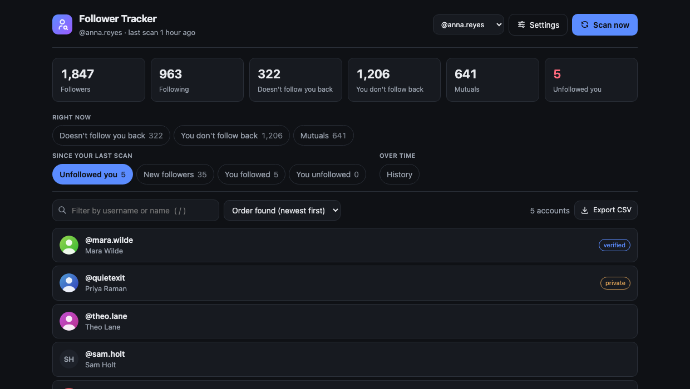
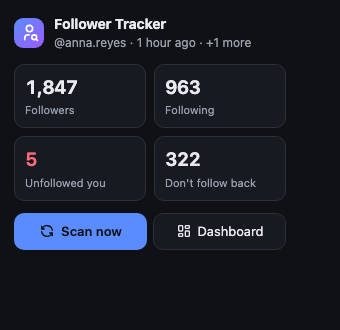
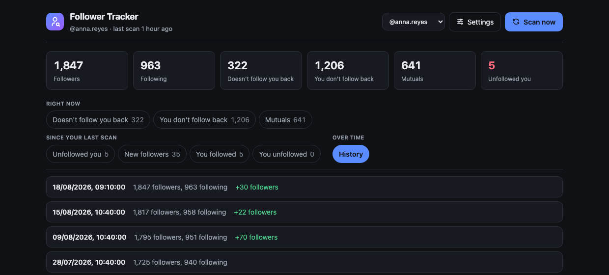
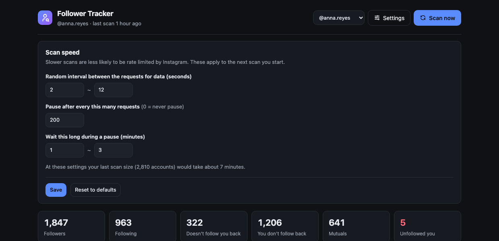

<h1 align="center">Follower Tracker</h1>

  <b>See who unfollowed you on Instagram.</b> 
  A free Instagram follower tracker for Chrome, Firefox and Safari.

  <a href="TECHNICAL.md">Install</a> ·
  <a href="#what-it-shows">Features</a> ·
  <a href="#what-it-looks-like">Screenshots</a> ·
  <a href="#its-free-really-free">Pricing</a> ·
  <a href="#your-data-never-leaves-your-computer">Privacy</a> ·
  <a href="LICENSE">MIT</a>

---

  

## The four things people ask first

> ### 💚 It is free. All of it, forever.
> No trial, no paid tier, no follower limit, no upsell, nothing to cancel.
> There is no way to pay for this even if you wanted to.

> ### 🔑 It never asks for your Instagram password.
> You are already logged into Instagram in your browser. It uses that. There
> is no login screen, no account to create, no email, no Google sign-in.

> ### 📡 It sends nothing about you to anyone. No telemetry, ever.
> No analytics, no tracking, no "anonymous usage stats", no crash reports, no
> ads. It talks to Instagram and to nothing else. Nobody — including the
> people who wrote this — can see that you use it or what you looked at.

> ### 💻 Your follower lists stay on your own computer.
> They are saved in your browser, on your machine, and never uploaded. There
> is no server, no cloud, no database anywhere. One button deletes the lot.

## Who unfollowed me on Instagram?

That's the question this answers. Press **Scan now**, and you get a plain list
of every account that unfollowed you since your last check.

**No sign-up. No password. No monthly fee. Nothing leaves your computer.
It is open source.**

> **Version 1.0.** Scanning, storage and the dashboard have been run against a
> live Instagram account on Firefox. Chrome shares the same code but has had
> less real-world use, and Safari needs a build step Apple requires — see
> [TECHNICAL.md](TECHNICAL.md).

## What it shows

| | |
| --- | --- |
| **Who unfollowed you** | Accounts that left since your last scan |
| **Who doesn't follow you back** | People you follow who don't follow you |
| **Who you don't follow back** | The reverse |
| **Mutuals** | People you both follow |
| **New followers** | Accounts that arrived since your last scan |
| **Recently followed / unfollowed** | Your own follow activity |
| **History** | Every scan, with the gain or loss |
| **Several accounts** | Each Instagram account is tracked separately |

Search, sort, and export any list to a spreadsheet (CSV).

If you use more than one Instagram account, each is tracked on its own. Scan
while logged into a different account and it gets its own history — switch
between them with the account picker at the top.

**Settings** lets you control how fast a scan runs — the gap between requests
and how often it takes a longer break — so you can trade speed for staying
under Instagram's radar.

## What it looks like

**One click from the toolbar** — a summary and a scan button, without opening
anything:

  

**Every scan, kept** — so you can see the shape of your account over months,
not just today:

  

**You decide how fast it runs** — slower scans are less likely to be rate
limited, and it tells you what your settings will cost in time:

  

Screenshots are the real extension with invented accounts. It follows
your system light or dark theme.

## It's free. Really free.

No trial. No paid tier. No follower cap. No account. No upsell. No card.

Most Instagram unfollower apps stop at 500 followers and ask for a
subscription. This one doesn't stop, because there is nothing to sell you.

| | Typical unfollowers app | Follower Tracker |
| --- | --- | --- |
| Price | Free trial, then monthly | **Free forever** |
| Follower limit | Capped until you pay | **None** |
| Sign-up | Google or email account | **None** |
| Your Instagram password | Sometimes asked for | **Never asked for** |
| Analytics / tracking | Common | **None at all** |
| Where your data lives | The company's servers | **Your own computer** |

It's published under the MIT licence, which means anyone can read the code and
check that all of this is true.

## Your data never leaves your computer

This is the part worth being precise about, so here it is in plain terms.

**What the extension talks to:** Instagram, and nothing else — the website for
your follower list, and Instagram's image servers for profile pictures. That's
the same place your browser is already talking to when you scroll Instagram,
and it asks for exactly what the Instagram app asks for.

**What it sends to us:** nothing. There is no "us". There is no server behind
this product, no account system, no database, no analytics company, no error
reporting service. Not "we anonymise it" — there is nowhere for it to go.

**Where your follower lists are kept:** in your browser's own storage, on your
computer, like a bookmark. They are never uploaded anywhere. **Delete all
stored data** in the footer erases them immediately and completely.

**What it does not load:** no outside fonts, scripts, or ads, and nothing at
all from any company other than Instagram. There are no third parties in this
product to load anything from.

**About the Firefox version.** Mozilla makes every add-on state, in writing,
what personal data it collects, and shows that to you before you install.
Follower Tracker's answer is **"none"** — the strongest option Mozilla offers.
It is a formal, checkable declaration, not a marketing promise.

Because it's open source, none of this needs to be taken on trust. The exact
commands to check it yourself are in [TECHNICAL.md](TECHNICAL.md).

## Two things to know before you use it

1. **It needs one build step.** This repository holds the source code, not a
   ready-to-click download. For Chrome and Firefox anyone technical can produce
   an installable version in about a minute — a single command, with nothing to
   install first. Safari is more work: Apple requires every Safari extension to
   be wrapped in an app with Xcode. Instructions: [TECHNICAL.md](TECHNICAL.md).
2. **Instagram doesn't officially allow tools like this.** Automatically
   reading your own follower list is against Instagram's terms of service —
   true of every follower tracker, paid ones included. Scans run slowly on
   purpose (about 25 minutes for a 10,000-follower account) and you can make
   them slower under **Settings**. Scan occasionally, not constantly.

## How it works

It reads your own follower and following lists using the Instagram session
you're already logged into, saves them on your computer, and compares each
scan to the last one. That comparison is everything you see.

## Docs

- [TECHNICAL.md](TECHNICAL.md) — build, install, storage, privacy checks
- [ANALYSIS.md](ANALYSIS.md) — why this was written from scratch

MIT licensed. Icon from [Tabler Icons](https://tabler.io/icons) (MIT).

---

Keywords: instagram follower tracker, who unfollowed me on instagram,
instagram unfollowers, unfollow tracker, ghost followers, non followers,
free instagram tracker, no password, chrome extension, firefox add-on,
no telemetry, private, open source.
